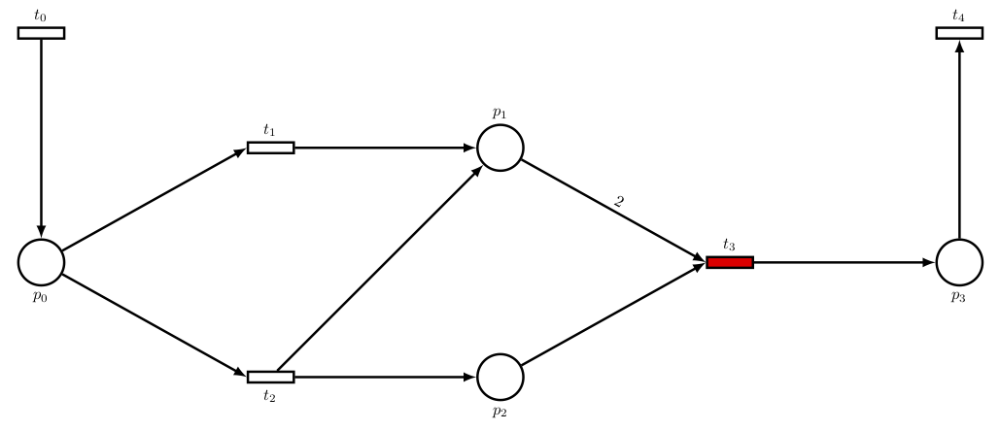
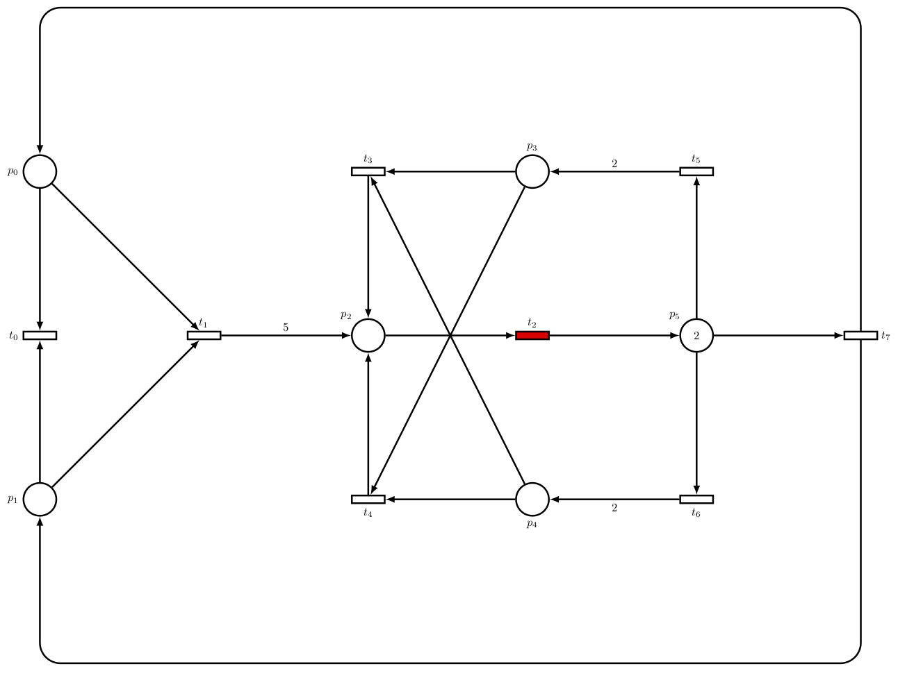

`petrisport` is a tool that computes some properties on Place/Transition
Petri nets for their use in [Petri sport, a sport for Petri netters](...).

Petri sport is proposed as a fun game based upon
the [Petri net](https://en.wikipedia.org/wiki/Petri_net) formalism.
In Petri sport,
players aim to gather points by moving across a Petri net
shaped playing field and 'firing' transitions.
As the playing field is shaped like a Petri net,
it is possible to challenge a player's movement speed,
intellectual capabilities, as well as team coordination and communication.

## Install

`petrisport` is available as a lua rock.
It requires a working install of the [Lua](https://www.lua.org)
programming language and of [Luarocks](https://luarocks.org).
They can both be installed using the following command:

```console
$ pip install hererocks # Requires python pip
$ hererocks --lua=^ --luarocks=^ ~/.lua-env
  # The lua environment is installed in $HOME/.lua-env
```

It can be installed easily using the following command:

```console
$ git clone https://github.com/cui-unige/petri-sport.git
$ cd petri-sport
$ ~/.lua-env/bin/luarocks make petrisport-master-1.rockspec
```

## Run

`petrisport` takes as input a Place/Transition Petri net,
either as a Lua file/module or as a PNML model,
for instance:

```console
# A Lua module:
$ petrisport petrinet.example.dimitri
# A PNML model given as a file:
$ petrisport TokenRing-PT-005/model.pnml
# A PNML model given as URL:
$ petrisport https://raw.githubusercontent.com/issamabd/PTNET-Editor/master/examples/philosophes.pnml
```

Help can be obtained as usual using the `-h` or `--help` option:
```console
$ petrisport --help
Usage: petrisport [--free <free>] [--deadlocks] [-h] <petrinet>

Arguments:
   petrinet              Petri net file or URL to load

Options:
   --free <free>         number of free tokens
   --deadlocks           show deadlocks
   -h, --help            Show this help message and exit.
```

## Output

`petrisport` generates the state space (the full behavior) of the Petri net
for a varying number of players (from those only in the initial marking to ∞),
and computes the following properties on it:

* the number of possible states;
* the number of deadlocks,
  that are states in which the game cannot advance;
  the number of deadlocking states,
  that can only lead to deadlocks, and thus to a frozen game;
  and the ratio of deadlocking states
  compared to all the states;
* the number of choices that can be made by players in each state
  (minimum, maximum, mean),
  and the ratio of states that have at least two choices
  compared to all the states;
* the number of states that can fire at least two transitions in parallel
  (minimum, maximum, mean),
  and the ratio of states that can at least fire two transitions in parallel
  compared to all the states;
* optionally, the tool can also compute all the deadlocks
  and show a path that leads to each one.

The output is for instance as below:
```console
$ petrisport --deadlocks petrinet.example.dimitri
INFO : Loading lua module petrinet.example.dimitri...
INFO : Model has been output in 'output.pdf'.
- free tokens: 0
  choice:
    min  : 0
    max  : 0
    mean : 0.0
    ratio: 0%
  parallel:
    min  : 0
    max  : 0
    mean : 0.0
    ratio: 0%
  # of states     : 1
  # of deadlocks  : 1
  # of deadlocking: 1
  % of deadlocking: 100%
  deadlock #1:
    state :  P0 = 0  P1 = 0  P2 = 0  P3 = 0  P4 = 0  P5 = 2  / 0
    path  :
    length: 1

...

- free tokens: 6
  choice:
    min  : 0
    max  : 6
    mean : 2.58
    ratio: 73%
  parallel:
    min  : 0
    max  : 3
    mean : 1.39
    ratio: 47%
  # of states     : 226
  # of deadlocks  : 13
  # of deadlocking: 40
  % of deadlocking: 18%
  deadlock #1:
    state :  P0 = 0  P1 = 0  P2 = 0  P3 = 0  P4 = 0  P5 = 0  / 8
    path  : T6 -> T7
    length: 3
  ...
```

For each deadlock, the state in deadlock is shown,
as well as the sequence of transitions that lead to it from the initial state.

## What are the rules of Petri sport?

Please look at [the article](...).

## What is a good Petri net for Petri sport?

As stated in [the article](...),
entertainment potential is a measure of how interesting
it should be to play a Sport Petri net.
In order to standardize this rather subjective figure,
we propose the following metrics to assess the entertainment potential:

* Number of states:
  A Sport Petri net with only a few reachable states if not interesting,
  because players will repeat the same actions over and over.
* Number of deadlock states:
  Playing should contain the risk of being trapped in a deadlock
  in order to keep the players focused on the game.
  This number should thus not be zero.
* Number of deadlocking states:
  States leading only to deadlocks are not of interest since
  players cannot escape the deadlock, whatever they do.
  The number of such states should thus remain low,
  compared to the total number of states.
* Choice ratio:
  Having more than two enabled transitions allows the players to chose
  which one to fire.
  They have to make a decision and coordinate, which makes the game more fun.
  A high choice ratio is thus a good thing.
* Parallel ratio:
  Firing several transitions in parallel is a risk in Sport Petri nets,
  because it allows players to gain more points,
  but at the increased risk of sudden death
  because coordination is more difficult.
  A high parallel ratio is thus a good thing.

This repository provides two example Petri nets:

* A sport Petri net that can be used as a tutorial.
  It features choices, synchronizations and parallel firing.
  
* A sport Petri net that can be played with trained teams.
  

Both can be tested in the tool using:

```console
$ petrisport --deadlocks petrinet.example.tutorial
$ petrisport --deadlocks petrinet.example.dimitri
```
